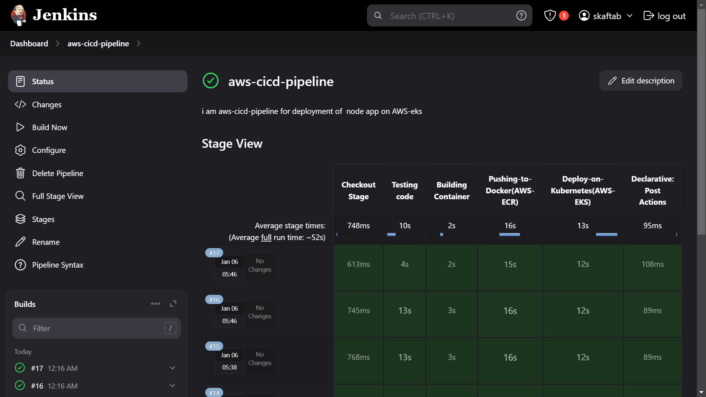

# 🚀 CI/CD Pipeline for AWS EKS, ECR, Docker, Jenkins, and AWS CLI

## 📝 Project Summary

This project demonstrates an **automated CI/CD pipeline** built using **Jenkins**, **AWS ECR**, **AWS EKS**, **Docker**, **AWS EC2**, **Load Balancer**, and **AWS CLI**. This pipeline ensures that every time developers push code to the main branch, a new Docker image is built, tested, stored, and deployed seamlessly to AWS EKS with **zero downtime** and **high availability**.

### 🔑 Key Highlights:
- **Automated Docker Image Creation:** Every time code is pushed to the **main branch**, Jenkins triggers the pipeline and builds a new Docker image tagged with the latest Jenkins build number.
- **Code Scanning & Testing:** The code is scanned and tested using **Mocha** to ensure quality and prevent issues.
- **AWS ECR for Docker Image Storage:** The Docker image is pushed to **AWS ECR** for secure and efficient storage.
- **AWS EKS for Deployment:** The application is deployed on **AWS EKS** with zero-downtime updates and scaling capabilities.
- **Kubernetes Features for Seamless Updates:** 
  - **Rolling Updates:** Kubernetes ensures that the application is updated without any downtime.
  - **Automatic Scaling:** Kubernetes scales the application based on traffic demands.
  - **Rollback Capabilities:** In case of failure, Kubernetes allows easy rollback to a previous version.
- **AWS EC2 & Load Balancer:** The application is hosted on **EC2** instances, and a **Load Balancer** ensures high availability and distributes traffic across multiple instances.

## 🛠️ Tools Used

- **Jenkins**: Automates the CI/CD pipeline.
- **Docker**: Containerizes the application.
- **AWS ECR**: Stores Docker images securely.
- **AWS EKS**: Manages Kubernetes for deployment and scaling.
- **AWS CLI**: Interacts with AWS services from the command line.
- **Kubernetes**: Manages container orchestration and application deployment.
- **AWS EC2**: Hosts the application instances.
- **AWS Load Balancer**: Ensures high availability and distributes traffic efficiently.

---

## 🏗️ How the Pipeline Works

1. **Checkout Stage**: The pipeline checks out the latest code from the **main branch**.
2. **Code Testing**: Installs dependencies and runs tests using **Mocha** to ensure everything works smoothly.
3. **Docker Build**: Builds a **Docker image** from the application code and tags it with the Jenkins build number.
4. **Push to AWS ECR**: The Docker image is pushed to **AWS ECR**, where it’s securely stored.
5. **Deploy to AWS EKS**: The Docker image is deployed to **AWS EKS**. If the deployment exists, it updates the image; if not, it creates a new one.
6. **Rolling Update in Kubernetes**: Kubernetes performs a **rolling update**, ensuring that the application remains available without downtime.
7. **Automatic Scaling**: The application automatically scales based on the incoming load.
8. **Rollback**: If any issue arises, Kubernetes allows you to easily **rollback** to a previous version of the application.

---

## 🔄 Features of the Pipeline

- **Zero Downtime Deployment**: The application is updated seamlessly without any downtime, thanks to Kubernetes **rolling updates**.
- **Scalable**: The application automatically scales based on traffic, handled by **Kubernetes** and **AWS EKS**.
- **Rollback**: In case of an issue, the application can be **rolled back** to a previous stable version using Kubernetes.
- **Fully Automated**: The entire process from code push to deployment is automated, reducing manual intervention.
- **High Availability**: The app is deployed across multiple **EC2** instances, and the **Load Balancer** ensures it’s always available to users.

---

## 📸 Jenkins Pipeline Output

Below is the **Jenkins pipeline output** showing all the steps and stages of the pipeline execution:

  
*Jenkins pipeline showing the different stages like checkout, testing, building, and deployment.*

---

## ⚙️ Tools Used

- **Jenkins** - CI/CD automation tool for building, testing, and deploying.
- **Docker** - For building and running the application in containers.
- **AWS ECR** - For storing Docker images.
- **AWS EKS** - Kubernetes-based container orchestration for deployment.
- **AWS CLI** - Command-line interface for AWS services.
- **Kubernetes** - For managing the application lifecycle and scaling.
- **AWS EC2** - Hosting application instances.
- **AWS Load Balancer** - Distributes traffic across EC2 instances.

---

## 🚀 How to Run the Pipeline Locally

To set up and run the pipeline locally, follow these steps:

1. **Clone the repository:**
    ```bash
    git clone https://github.com/skaftab-in/simple-devops-website.git
    ```
2. **Install Jenkins & Dependencies:** Ensure Jenkins is installed along with necessary plugins for Docker, AWS CLI, and Kubernetes.
3. **Set up AWS CLI:** Configure AWS CLI with the correct credentials:
    ```bash
    aws configure
    ```
4. **Set up EKS and ECR:** Make sure your **AWS EKS** and **ECR** are properly configured.

---

## 💬 Conclusion

This project demonstrates the power of modern CI/CD tools like **Jenkins**, **Docker**, **AWS ECR**, and **AWS EKS**. The fully automated pipeline ensures that updates are pushed, tested, and deployed with zero downtime. Additionally, the pipeline makes use of **Kubernetes'** rolling updates and scaling features, ensuring high availability and the ability to roll back in case of issues. This setup provides a seamless, highly available, and scalable solution for deploying applications in production.

---

### 🌐 GitHub Repository: [aws-cicd-pipeline-eks-ecr](https://github.com/skaftab-in/aws-cicd-pipeline-eks-ecr)
