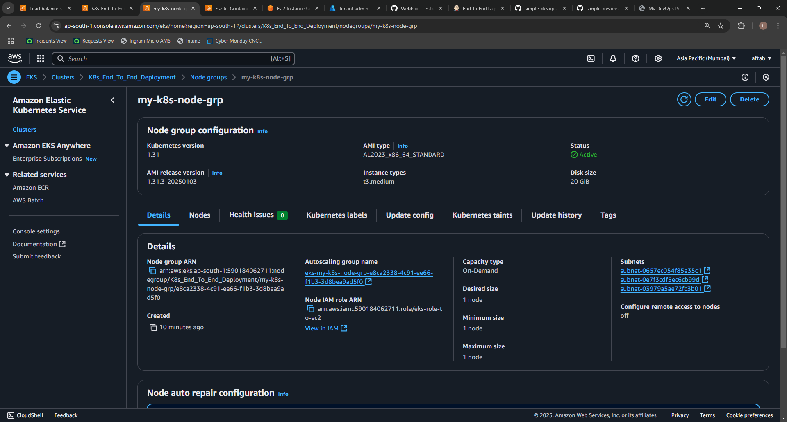
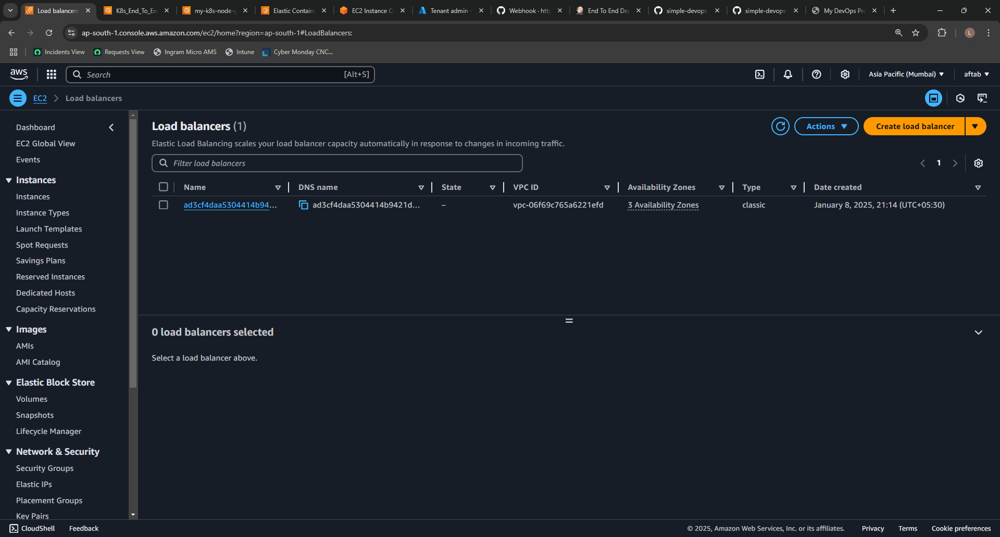
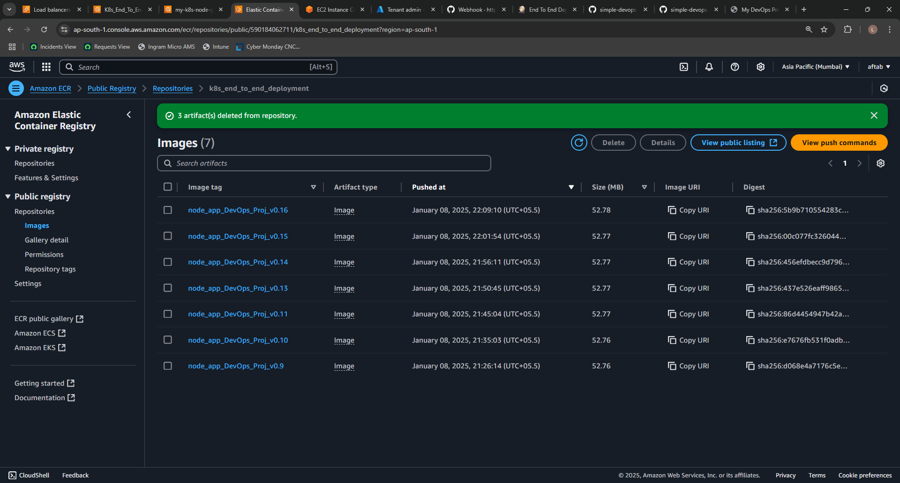
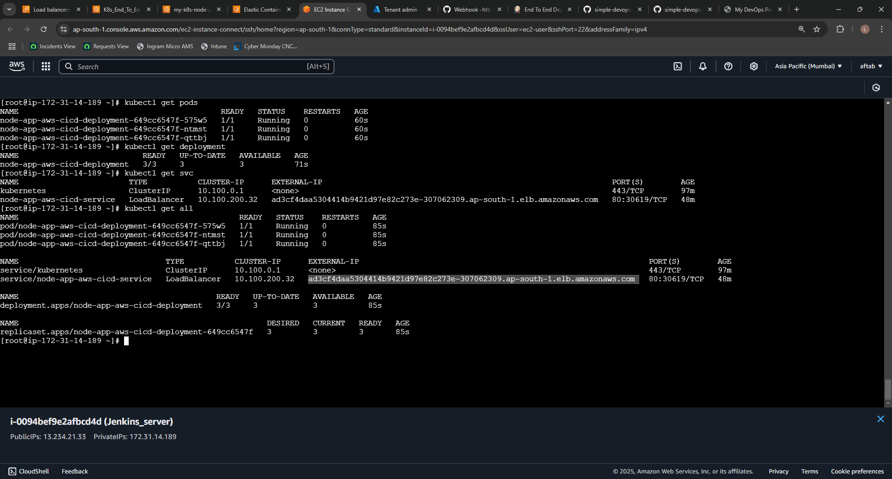
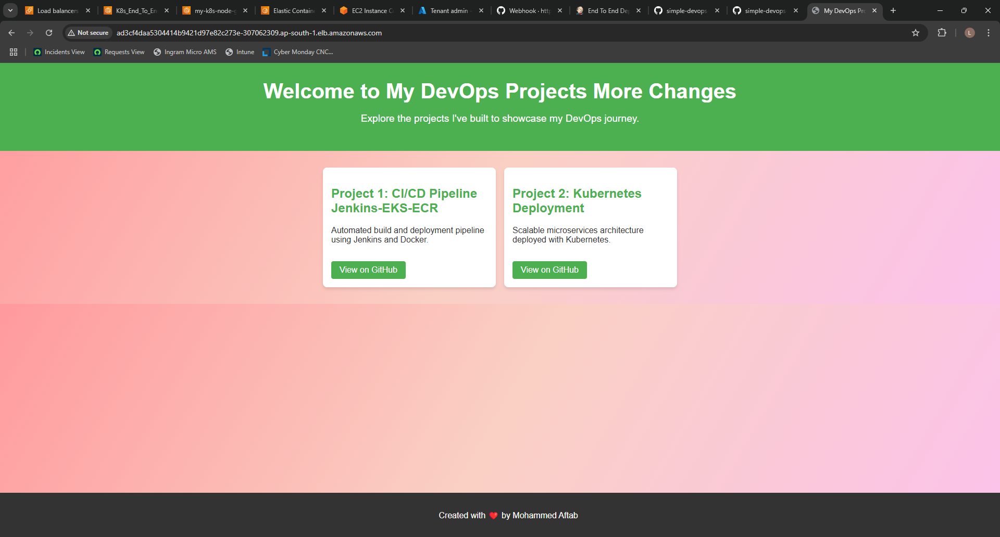
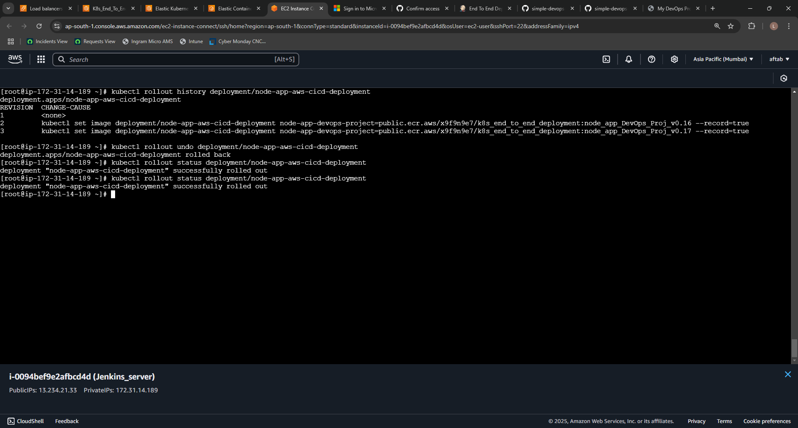

# 🚀 CI/CD Pipeline for AWS EKS, ECR, Docker, Jenkins, and AWS CLI

## 📝 Project Summary
This project demonstrates an **automated CI/CD pipeline** built using **Jenkins**, **AWS ECR**, **AWS EKS**, **Docker**, **AWS EC2**, **Load Balancer**, **AWS CLI**, and a **Node.js** application. The pipeline ensures **END-to-END Deployment**, where every time developers push code to the **main** branch, a new Docker image is built, tested, stored, and deployed seamlessly to AWS EKS, ensuring **high availability**.

## 🛠️ Tools Used

- **Jenkins**: Automates the CI/CD pipeline.
- **Docker**: Containerizes the application.
- **AWS ECR**: Stores Docker images securely.
- **AWS EKS**: Manages Kubernetes for deployment and scaling.
- **AWS CLI**: Interacts with AWS services from the command line.
- **Kubernetes**: Manages container orchestration and application deployment.
- **AWS EC2**: Hosts the Jenkins server.
- **AWS Load Balancer**: Distributes traffic across the pods efficiently.

---

## 🏗️ Pipeline Components and Details

### 1. **AWS EKS Cluster**

The **AWS EKS Cluster** is the backbone of this project. It provides a managed Kubernetes environment where the application is deployed. The cluster ensures scalability, reliability, and ease of management.


### 2. **Node Group**

The **Node Group** consists of EC2 instances managed by AWS EKS. These nodes run the Kubernetes pods that host the application. The group ensures efficient resource allocation and scaling.



### 3. **Elastic Load Balancer (ELB)**

The **Elastic Load Balancer** distributes incoming traffic across the Kubernetes pods, ensuring high availability and balancing the load efficiently.



### 4. **AWS ECR**

The **AWS Elastic Container Registry (ECR)** securely stores the Docker images built during the pipeline. These images are used for deployment to the EKS cluster.



### 5. **GitHub Webhook**

A **GitHub Webhook** is configured to trigger the Jenkins pipeline automatically whenever new code is pushed to the repository.


### 6. **Jenkins Pipeline**

The **Jenkins Pipeline** automates the entire CI/CD process, from building and testing the application to deploying it on AWS EKS. The pipeline is configured to handle rolling updates and rollbacks seamlessly.


### 7. **Changes Reflected After Pipeline Execution**
The **CICD pipeline** is triggered automatically via a GitHub webhook, executing all defined stages sequentially, from code checkout to deployment on AWS EKS.



**Description:**
- `kubectl get pods`: Displays all running pods.
- `kubectl get svc`: Lists all services and their endpoints.
- `kubectl get all`: Provides a complete overview of Kubernetes resources.

- **First Output:** The initial version of the application is deployed after pushing code to the GitHub repository. The first version of the basic page is displayed.


#### **Frontend Updates**
- **Change 1:**  Changes to `index.html` trigger the pipeline, and the updated content is reflected on the frontend.

-

- **Change 2:** Additional modifications are made to the application, and these changes are seamlessly deployed and reflected on the live website post pipeline execution.
 

### 8. **Kubernetes Rolling Updates**


Kubernetes ensures zero downtime by performing rolling updates. If a deployment fails, Kubernetes can roll back to a previous stable version.




---

## 🔄 Features of the Pipeline

- **Zero Downtime Deployment**: The application is updated seamlessly without any downtime, thanks to Kubernetes **rolling updates**.
- **Rollback**: In case of an issue, the application can be **rolled back** to a previous stable version using Kubernetes.
- **Fully Automated**: The entire process from code push to deployment is automated, reducing manual intervention.

---

## Jenkins Pipeline Configuration 📋

### Key Features:

- Automatically builds and pushes Docker images with a unique tag (`BUILD_NUMBER`).
- Deploys to AWS EKS using Kubernetes manifests.
- Ensures zero-downtime updates with Kubernetes rollouts.

### Jenkinsfile

```groovy
pipeline {
    agent any
    environment {
        IMAGE_NAME = "public.ecr.aws/x9f9n9e7/aws_cicd_pipeline_ecr"
        IMAGE_TAG = "node_app_DevOps_Proj_v0.${env.BUILD_NUMBER}"
        K8S_DEPLOYMENT = "node-app-aws-cicd-deployment"
        AWS_REGION = "ap-south-1"
        cred = credentials('aws-cred')
    }
    stages {
        stage('Checkout Stage') {
            steps {
                checkout scmGit(branches: [[name: '*/main']], extensions: [], userRemoteConfigs: [[url: 'https://github.com/skaftab-in/simple-devops-website.git']])
            }
        }
        stage('Testing code') {
            steps {
                sh 'echo I am scanning the code'
                sh 'npm install mocha --save-dev'
                sh 'npm test'
            }
        }
        stage('Building Container') {
            steps {
                script {
                    sh """
                    docker build -t ${IMAGE_NAME}:${IMAGE_TAG} .
                    """
                }
            }
        }
        stage("Pushing-to-Docker(AWS-ECR)"){
            steps{
                sh """
                aws ecr-public get-login-password --region us-east-1 | docker login --username AWS --password-stdin public.ecr.aws/x9f9n9e7
                docker push ${IMAGE_NAME}:${IMAGE_TAG}
                """
            }
        }
        stage("Deploy-on-Kubernetes(AWS-EKS)"){
            steps{
                script {
                    sh """ 
                      aws eks update-kubeconfig --region ${AWS_REGION} --name K8s_for_aws-cicd-pipeline
                      if kubectl get deployment ${K8S_DEPLOYMENT}; then
                       kubectl set image deployment/${K8S_DEPLOYMENT} node-app-devops-project=${IMAGE_NAME}:${IMAGE_TAG} --record
                      else
                        kubectl apply -f app.yaml
                      fi
                        kubectl rollout status deployment/${K8S_DEPLOYMENT}
                    """
                }
            }
        }
    }
    post {
        always {
            echo 'Pipeline execution completed.'
        }
        success {
            echo 'Pipeline completed successfully. The application is deployed in production.'
        }
        failure {
            echo 'Pipeline execution failed.'
        }
    }
}
```

---
## ☸️ Kubernetes YAML File

The Kubernetes deployment and service manifest file (`app.yaml`) is used for deploying the application and exposing it via a LoadBalancer.

```yaml
apiVersion: apps/v1
kind: Deployment
metadata:
  name: node-app-aws-cicd-deployment
spec:
  replicas: 3 
  selector:
    matchLabels:
      app: node-app-devops-project
  template:
    metadata:
      labels:
        app: node-app-devops-project
    spec:
      containers:
      - name: node-app-devops-project
        image: public.ecr.aws/x9f9n9e7/k8s_end_to_end_deployment:node_app_DevOps_Proj_v0.15
        ports:
        - containerPort: 3000

---
apiVersion: v1
kind: Service
metadata:
  name: node-app-aws-cicd-service
spec:
  type: LoadBalancer
  selector:
    app: node-app-devops-project
  ports:
  - protocol: TCP
    port: 80
    targetPort: 3000
```

---

## 🚀 How to Run the Pipeline Locally

To set up and run the pipeline locally, follow these steps:

1. **Clone the repository:**
    ```bash
    git clone https://github.com/skaftab-in/simple-devops-website.git
    ```
2. **Install Jenkins & Dependencies:** Ensure Jenkins is installed along with necessary plugins for Docker, AWS CLI, and Kubernetes.
3. **Set up AWS CLI:** Configure AWS CLI with the correct credentials:
    ```bash
    aws configure
    ```
4. **Set up EKS and ECR:** Make sure your **AWS EKS** and **ECR** are properly configured.

---

## 💬 Conclusion

This project demonstrates the power of modern CI/CD tools like **Jenkins**, **Docker**, **AWS ECR**, and **AWS EKS**. The fully automated pipeline ensures that updates are pushed, tested, and deployed with zero downtime. Additionally, the pipeline makes use of **Kubernetes'** rolling updates and scaling features, ensuring high availability and the ability to roll back in case of issues. This setup provides a seamless, highly available, and scalable solution for deploying applications in production.

---

---

## 📢 Stay Connected  
Proudly created, deployed, and documented by **Mohammed Aftab**.  

Feel free to connect with me:   
[](https://github.com/skaftab-in)  [](www.linkedin.com/in/aftab-m)  [](https://www.instagram.com/skaftab.in/) 

 
Have suggestions or feedback? Drop a message!

---

